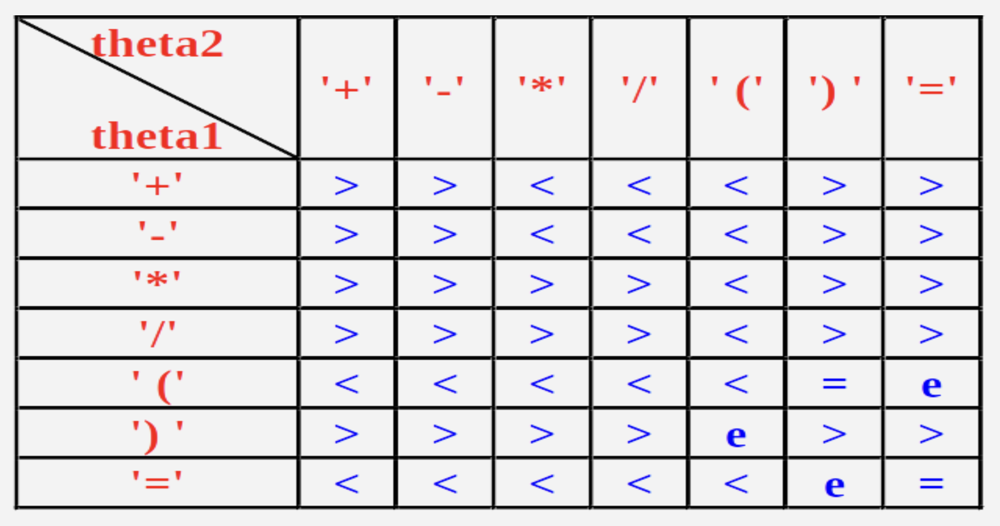

# Chapter 3 栈和队列

## 栈

定义：栈是限制在一端进行插入和删除运算的**线性表**。

- 通常称进行插入、删除操作的这一端为栈顶 (top)，另一端为栈底 (bottom)
- 若有栈 $(a_1, a_2, ..., a_n)$，则称 $a_1$ 为栈底元素，$a_n$ 为栈顶元素，栈中元素按照 $a_1, a_2, ..., a_n$ 的顺序进栈

### 顺序栈

定义：栈的顺序存储结构，是利用一组地址连续的存储单元依次存放自栈底到栈顶的数据元素，同时设置指针 top 指示栈顶元素在顺序栈中的位置。

- **通常使用数组实现顺序栈，所以会面临溢出的问题**
- 是先进后出类型

多栈共享：多个栈共享一个或多个数组，可以合理利用存储单元。

- 主要是 2 个栈共用一个数组，一个用前部分一个用后部分，它主要利用了“栈底位置不变，而栈顶位置动态变化”的特性

> 为两个栈共同申请一个长度为 M 的一维数组，栈底分别设在数组的两端，0 和 M- 1。由于两个栈顶动态变化，这样可以形成互补，使得每个栈可用的最大空间与实际使用的需求相关。由此可见，两栈共享比两个栈分别申请M/2的空间利用率高。

### 链式栈

定义：栈的链式存储结构，是运算受限的单链表。

- 链式栈无栈满问题，空间可扩充

### 实际应用

#### 括号匹配

算法：

- 设置一个栈
- 每读入一个括号，若是左括号，则直接入栈，等待相匹配的同类右括号
- 若读入的是右括号，且与当前栈顶的左括号同类型，则二者匹配，将栈顶的左括号弹出
- 如果读入的右括号和栈顶的左括号不匹配，则非法
- 如果输入序列已读尽，而栈中仍有等待匹配的左括号，或者读入了一个右括号，而栈中已无等待匹配的左括号，均属不合法
- 当输入序列和栈同时变为空时， 说明所有括号完全匹配

#### 中缀表达式求值

算法：

- 使用两个栈，操作符栈 (optr) 和操作数栈 (opnd)
- 先在 optr 中压入一个 =
- 从输入流中获取一个字符 ch
- 从 optr 中取出一个栈顶内容 optrTop，如果 optrTop 不是 =，循环以下内容，否则结束算法然后从 opnd 的栈顶得到运算结果
- 如果 ch 是操作数，则放入 opnd
- 如果 ch 是操作符，则比较 optrTop 和 ch 的优先级
  - **如果 ch > optrTop，则 ch 进入 optr**
  - **如果 ch < optrTop**，则从 opnd 中推出两个操作数 a, b，从 optr 中推出 optrTop，执行 a optrTop b 并将结果压入 opnd 中
  - 如果 optrTop = ch 且 ch == )，则 optrTop 一定为 (，则从 optr 中推出 optrTop 并对消括号
  - 如果 optrTop 和 ch 不兼容，则出现错误

#### 后缀表达式

算法：

- 从头到尾读取中缀表达式中的每个符号 ch
  - 如果 ch 是运算数，则直接输出
  - 如果 ch 是左括号，则压入栈中
  - 如果 ch 是右括号，则将栈中的元素依次弹出输出直到遇到左括号
  - 如果 ch 是运算符
    - 若 ch > optrTop，则将 ch 压入栈中
    - 若 ch < optrTop，则将 optrTop 弹出并输出，与新的 optrTop 进行比较
- 当中缀表达式为空时，将栈中的符号全部弹出并输出

## 队列

定义：队列是只允许在一端删除，另一端插入的线性表。

- 允许插入的一端叫做队尾，允许删除的一端叫做队头

- 是先进先出类型

### 顺序队列 （循环队列）

定义：队列的顺序存储结构称为顺序队列，一般用一维数组来表示队列的顺序存储结构。

- 由于队头和队尾的位置是变化的，所以附设两个指针分别指向队列头元素和队列尾元素的位置
- 每当插入新的队尾元素，尾指针增 1；每当删除队头元素，头指针增 1
- 顺序存储方式一般有溢出问题

假溢出问题：尾指针虽然已经指向队尾，但是队列的前面部分仍然有可用空间，在这种状态时，不可再继续插入新的队尾元素，否则会出现数组越界的现象；然而此时也不宜进行再分配扩大数据空间，因为队列的实际空间并没有被占满，这是一种假溢出。

解决办法：将队列元素存放数组首尾相接，形成循环 (环形) 队列；另一个方法是采用数据前移，让空存储单元留在队尾。

### 链式队列

定义：队列的链式存储结构。

- 链式队列无队满问题，但是有队空问题，队空条件为 front = rear

