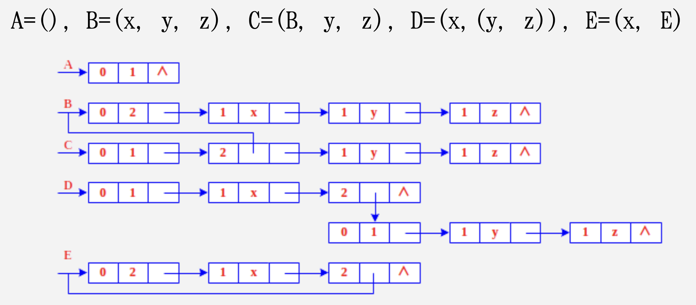

# Chapter 5 数组和广义表

## 数组

定义：由一组类型相同的数据元素构成，每一个元素可直接按序号寻址的线性表。

> 通常很少对数组进行插入和删除的操作。数组的元素个数是固定的，一旦定义了数组的维数和每一维的上下限，数组中元素的个数就固定了。

数组一般使用顺序存储结构，而不使用链式存储结构。

数组元素的地址公式: $loc(a[i, j]) = loc[0, 0] + i * n + j$

### 矩阵

定义：矩阵可以看作一个二维数组。

特殊矩阵：

- 对称矩阵：对称矩阵中的元素关于主对角线对称，故只要存储矩阵中上三角或下三角中的元素，让每两个对称的元素共享一个存储空间，这样能节约近一半的存储空间
- 三角矩阵：三角矩阵分为上三角矩阵和下三角矩阵，对角线及其以上或对角线及其以下的元素为常数，其他值为 0
- 对角矩阵：非零元素出现在主对角线和相邻的对角线上

稀疏矩阵：矩阵中的非零元素有 s 个，总元素个数为 $m*n$。如果 s 远小于 $m * n$，则称该矩阵为稀疏矩阵。

稀疏因子：$e = \frac{s}{m * n}$

一般当 $e \le 0.05$ 时，称该矩阵为稀疏矩阵。

## 广义表

定义：线性表定义为 $n \ge 0$ 个元素 $a_1,a_2,a_3,…,a_n$ 的有限序列。线性表的元素仅限于原子项，原子是作为结构上不可分割的成分，它可以是一个数或一个结构。若放松对表元素的这种限制，容许它们具有其自身结构，这样就产生了广义表的概念。

- n 为表的长度
- $n \gt 0$ 时，表的第一个元素是表头，表的剩余元素组成的表称为表尾

> 任何一个非空列表的表头可能是原子也可能是表，任何一个非空列表的表尾一定是表。

广义表举例：

- $A = ()$ 是一个空表
- $B = (e)$ 是一个长度为 1，元素只有一个原子的广义表
- $C = (a, (b, c, d))$ 是一个长度为 2，两个元素分别为 $a$ 和 $(b, c, d)$ 的广义表
- $E =(a, E)$ 是一个递归表，长度为 2

广义表的长度：即广义表中元素的个数。

广义表的深度：广义表中括号最大的嵌套层数。

### 广义表的存储结构

由于广义表中的元素可以是原子也可以是另一个广义表，所以不能使用顺序存储结构，一般使用链式存储结构。

广义表一般需要两种结构的结点，一种是表结点，用来表示列表；一种是原子结点，用来表示原子。

