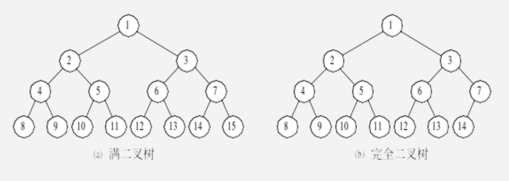
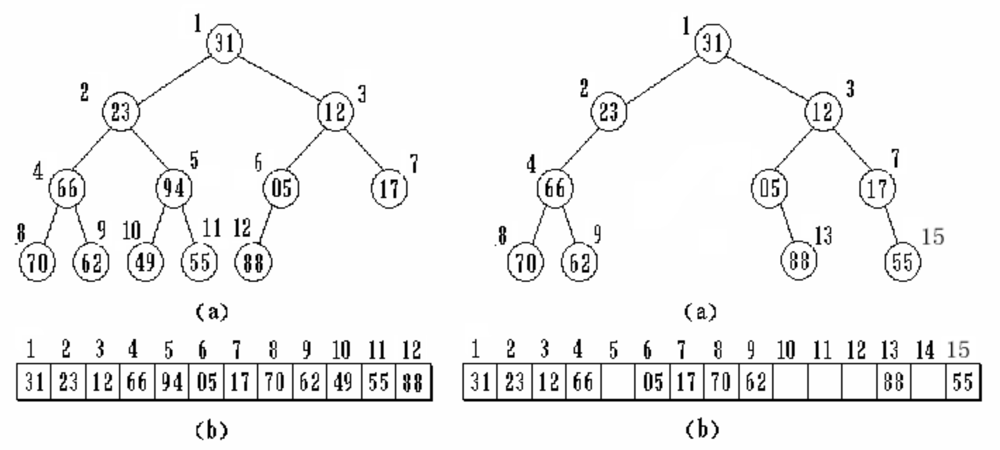
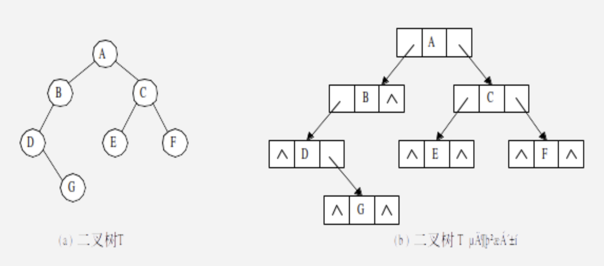
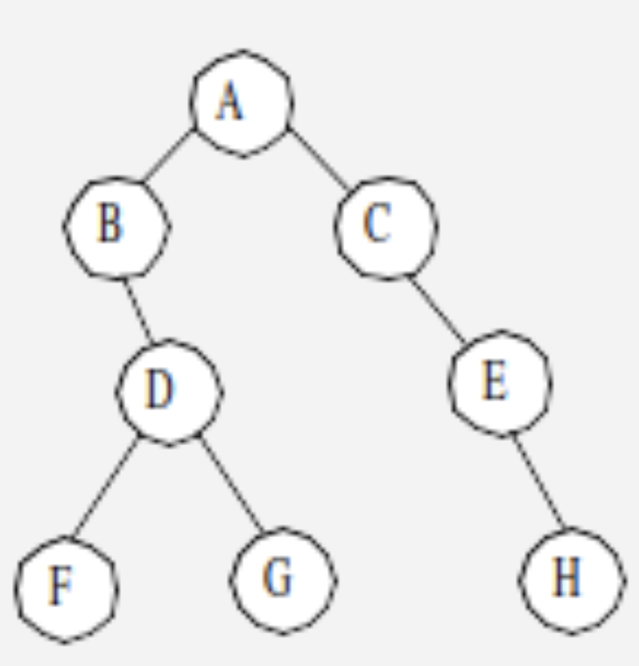
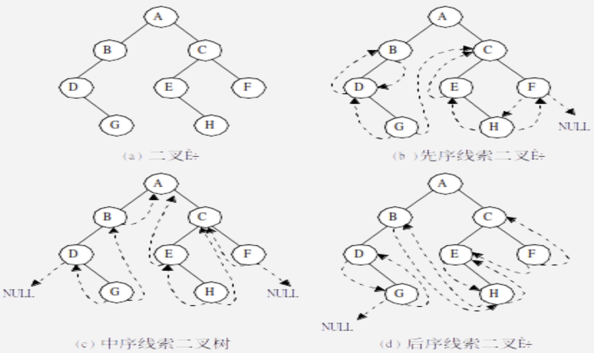

# Chapter 6 树

## 树的基本概念

叶子节点：度为 0 的结点，即无后继的结点。

分支节点：度不为 0 的节点。

节点的度: **一个节点所拥有的子节点的个数**。

树的度：树中所有节点的度的最大值。

节点的层次：从根节点开始定义，根节点的层次为 1，它的直接后继节点的层次为 2，以此类推。

树的深度：树中所有节点的层次的最大值。

## 二叉树

定义：满足每个节点的度不大于 2 并且每个节点的子节点次序不能任意颠倒的树称作二叉树。

- 二叉树的子节点必须区分左子树和右子树，即便只有一个子树也必须区分

> 二叉树是一种特殊的树，任何的树和森林都可以转化为二叉树，这样就解决了树的存储结构及其运算中存在的复杂性。

二叉树的性质：

- 二叉树的第 $i$ 层至多有 $2^{i - 1}, i \ge 1$ 个节点
- 深度为 $k$ 的二叉树至多有 $1 + 2^1 + 2^2 + .. + 2^k = 2^k - 1$ 个节点
- **对于任何一个二叉树，如果有 $n_0$ 个叶子节点, $n_2$ 个度为 2 的节点，则 $n_0 = n_2 + 1$**
- 给定一个树，有唯一的二叉树与之对应

> [!TIP]
>
> 例：在一个度为 4 的树中，有 20 个度为 4 的节点，10 个度为 3 的节点，1 个度为 2 的节点，10 个度为 1 的节点，这个树的叶节点个数为多少个？
>
> 解：
>
> $\because$ 每一个节点 (除了根节点) 的上方都有一条分支连接该节点
>
> $\therefore$ 假设叶节点的个数为 $t$，则一共有 $20 + 10 + 1 + 10 + t - 1$ 条分支
>
> $\because$ 一个节点有多少个度，就表明这个节点有多少条分支
>
> $\therefore$ 共有 $20 * 4 + 10 * 3 + 1 * 2 + 10 * 1 + t * 0$ 个分支
>
> $\therefore$ $20 + 10 + 1 + 10 + t - 1 = 20 * 4 + 10 * 3 + 1 * 2 + 10 * 1 + t * 0, t = 82$

### 满二叉树和完全二叉树

满二叉树的定义：深度为 $k$ 且有 $2^k - 1$ 个节点的二叉树就是满二叉树。在满二叉树中，所有的分支节点的度都是 2。

完全二叉树的定义：深度为 $k$ 且节点数为 $n$ 的二叉树，如果其节点 $1 - n$ 的位置序号和满二叉树的位置序号一一对应，则是完全二叉树。

- 满二叉树一定是完全二叉树，但是完全二叉树不一定是满二叉树
- **完全二叉树的所有叶子节点都出现在 $k$ 层或者 $k - 1$ 层**
- **对于完全二叉树的任意分支节点，如果其右子树的深度为 $D$，那么左子树的深度一定为 $D$ 或者 $D + 1$**
- **具有 $n$ 个节点的完全二叉树的深度为 $[\log_2{n}] + 1$**
- **完全二叉树中度为 1 的节点数为 $n_1$，$n_1 = 0$ 或者 $n_1 = 1$**

> [!TIP]
>
> 例：已知一个完全二叉树的第 6 层有 8 个叶节点，则该完全二叉树的节点个数最多是多少个？
>
> 解：
>
> $\because$ 在深度为 $k$ 的完全二叉树中，叶节点只会出现在 $k - 1$ 或者 $k$ 层
>
> $\therefore$ 该完全二叉树的深度为 6 或者 7，因为求节点最多个数，则深度应为 7
>
> $\because$ 因为该完全二叉树的深度为 7，所以前面 6 层一定是满二叉树，前 6 层节点数为 $2^0 + 2^1 + 2^2 + .. + 2^5 = 2^6 - 1 = 63$
>
> $\because$ 第六层有 8 个叶节点，且第 6 层一共有 $2^5 = 32$ 个节点
>
> $\therefore$ 第 6 层中有 $32 - 8 = 24$ 个分支节点，并且这 24 个分支节点最多能产生 $24 * 2 = 48$ 个第 7 层的叶节点
>
> $\therefore$ 一共有 $63 + 48 = 111$ 个节点

### 二叉树的存储结构

顺序存储结构：用一组连续的存储单元存储二叉树的数据元素，从树根起，自上到下从左到右地给所有节点编号。

链式存储结构：二叉树的结点由一个数据元素和分别指向其左、右子树的两个分支构成。利用这种结点结构所得到的二叉树存储结构称为二叉链表。

### 二叉树的遍历

**已知二叉树的先序遍历和中序遍历可以唯一确定一个二叉树，已知二叉树的后序遍历和中序遍历可以唯一确定一个二叉树，已知二叉树的先序遍历和后序遍历不一定能唯一确定一个二叉树**。

#### 先序遍历

1. 访问根节点
2. 按照先序遍历访问左子树
3. 按照先序遍历访问右子树

#### 中序遍历

1. 按照中序遍历访问左子树
2. 访问根节点
3. 按照中序遍历访问右节点

#### 后序遍历

1. 按照后序遍历访问左子树
2. 按照后序遍历访问右子树
3. 访问根节点

> [!TIP]
>
> 例：对于如图所示的二叉树，请分别写出其先序遍历、中序遍历、后序遍历。
>
> 
>
> 解：
>
> - 先序遍历: $A \to B \to D \to F \to G\ \to C \to E \to H$
> - 中序遍历: $B \to F \to D \to G \to A \to C \to E \to H$
> - 后序遍历: $F \to G \to D \to B \to H \to E \to C \to A$

### 线索二叉树

线索：指向线性序列中前驱和后继节点的指针叫做线索。

线索链表：包含线索的链表叫做线索链表。

- 如果一个分支节点的左子树为空，则指向其前驱节点
- 如果一个分支节点的右子树为空，则指向其后继节点

## 哈夫曼树

定义：哈夫曼树又称作最优二叉树，是一类带权路径长度最短的树。