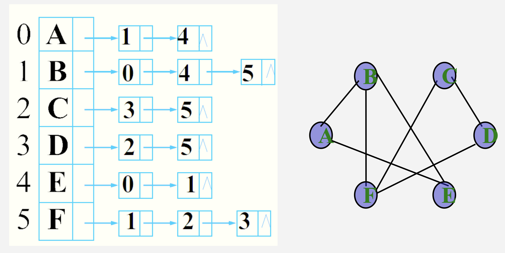
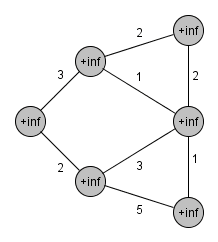
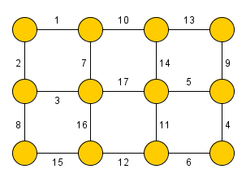
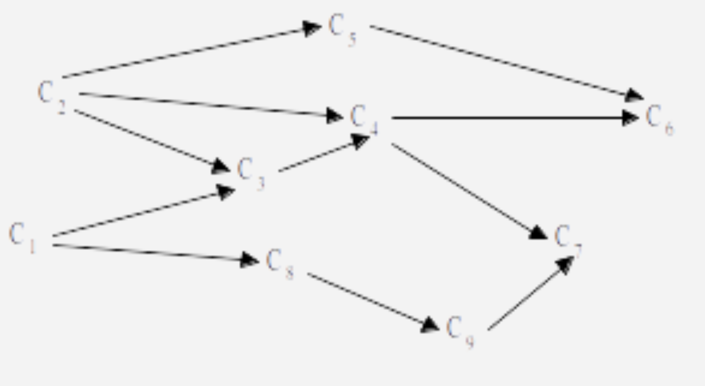
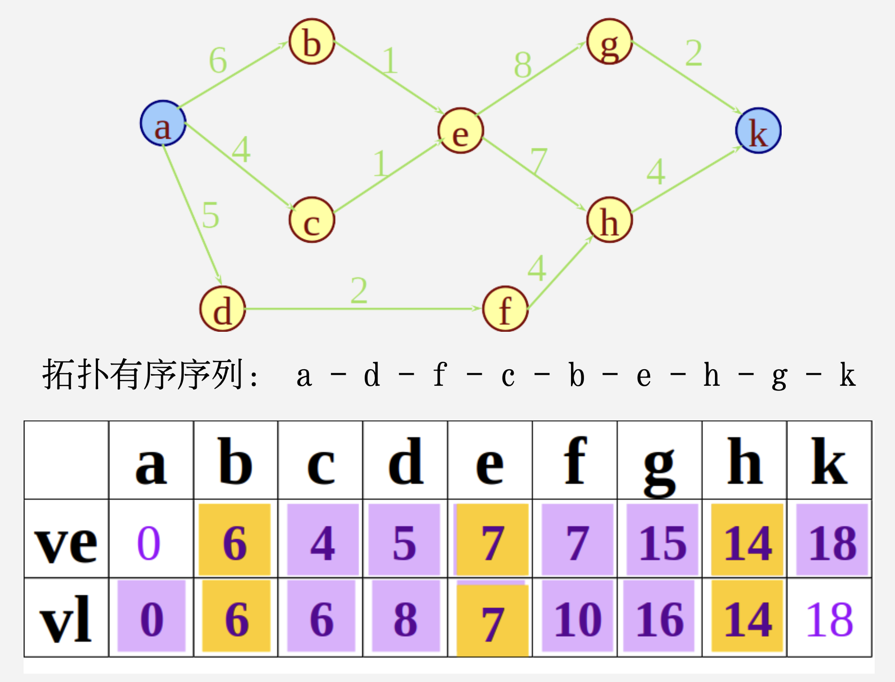
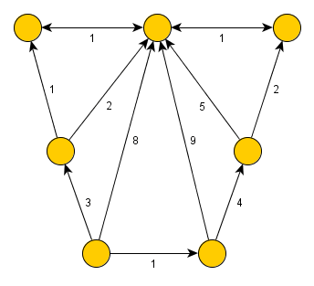

# Chapter 7 图

## 定义与术语

### 弧和边

弧：在图中如果顶点 x 到顶点 y 相连，则用 <x, y> 表示。x 称为弧尾，y 称为弧头 ($x \rightarrow y$)。

边：在无向图中，如果有 <x, y> 则必有 <y, x>，那么用无序对 (x, y) 来代替两个有序对，称为 x 与 y 之间的一条边。

> **弧和边的区别在于有没有方向**。

### 完全图

**网：如果图的每一条边都带权，则称该图为网**。

完全图：在有 n 个节点的无向图中，如果有 $C^2_n$ 条边（忽略自身到自身的边），则称为完全图。

有向完全图：在有 n 个节点的有向图中，如果有 $A^2_n$ 条边（忽略自身到自身的边），则称为有向完全图。

稀疏图：在有 n 个节点的图中，若边数少于 $n \log n$，则称为稀疏图，反之称为稠密图。

### 度

度：对于无向图而言，顶点 v 的度是指和 v 相关联边的数目；在有向图中，一个顶点的度分为出度和入度，出度和入度之和等于该顶点的度。

**度与边的关系：$e = \frac{\sum_{i=1}^nTD(v_i)}{2}$，度数和除以 2 就是边的个数**f。

### 路径

路径：从顶点 u 到顶点 v 经过的边的个数。

回路：在一条路径中，如果第一个点和最后一个点是相同的，则称为回路。

简单路径：在一条路径中，出现的顶点各不相同。

简单回路：在一条回路中，只有第一个点和最后一个点是相同的，其余点都不相同。

### 连通图

连通图：**无向图**中如果图中任意两个点都是连通的，则称该图为连通图。

极大连通子图：极大连通子图称为该无向图的连通分量。

强连通图：**有向图**中如果任意两点 u 和 v 都存在从 u 到 v 的路径，则称为强连通图。

极大强连通子图：有向图的极大强连通子图称作有向图的强连通分量。

> 注意区分连通图和强连通图：
>
> - 连通图这个概念只针对于无向图
> - 强连通图和弱连通图这两个概念只针对于有向图

### 生成树

生成树：如果一个连通图有 n 个顶点和 e 条边，其中 n-1 条边和 n 个顶点构成一个联通图，则称该连通图为生成树。

> **生成树不是唯一的**。
>
> **给生成树添上任意一边，都会构成一个回路**。

- 如果一个图有 n 个顶点和小于 n-1 条数的边，则一定是非连通图
- 如果一个图有 n 个顶点和大于 n-1 条数的边，则一定有回路。

生成森林：对于非连通图，由各个极大连通分量的生成树构成的集合就是生成森林。

## 图的存储表示

### 邻接矩阵

- 在无向图中,统计第 i 行或列 1 的个数可得顶点 $v_i$ 的度
- 在有向图中,统计第 i 行 1 的个数可得顶点 $v_i$ 的出度，统计第 j 列 1 的个数可得顶点 $v_j$ 的入度

> 无向图邻接矩阵对角线上的元素为 0，因为在无向图中不允许有自环。

### 邻接表

图的邻接矩阵表示法 (即图的数组表示法)，虽然有 其自身的优点，但对于稀疏图来讲，用邻接矩阵的表示方法会造成存储空间的很大浪费。

在邻接表中，给每个顶点建立一条链表，首元结点表示该顶点，其余结点表示和该节点链接的节点；在有向图中，其余结点表示以首元结点为起点的连接节点。

> 邻接表很难得到有向图的入度，一种方法是建立逆邻接表。

## 图的遍历

### 深度优先搜索

- 邻接表的 DFS 时间复杂度为 $O(n+e)$，其中 n 是节点数，e 是边数
- 邻接矩阵的 DFS 时间复杂度为 $O(n^2)$，其中 n 是节点数

> DFS（深度优先遍历）的时间复杂度取决于**我们需要“扫描”多少个位置才能找到所有的边**。
>
> 在邻接矩阵中，图被表示为一个 n×n 的二维数组。无论图中实际有多少条边，数组的大小始终是固定的。
>
> - **查找过程**：当我们访问一个顶点 u 并尝试寻找它的邻居时，算法必须遍历数组中 u 这一整行
> - **计算逻辑**：
>   - 对于每一个顶点（共 n 个），你都必须检查所有可能的连接点（共 n 个）
>   - 即使一个顶点只有 1 条边，你也要查看其他 n−1 个位置（检查它们是否为 0 或空）
> - **结论**：总的扫描次数是 n×n，因此复杂度为 $O(n^2)$
>
> 在邻接表中，每个顶点只维护一个链表（或动态数组），其中仅包含与该顶点**真正相连**的边。
>
> - **查找过程**：当我们访问顶点 u 时，我们直接遍历它对应的链表。链表的长度恰好就是该顶点的度（degree）
> - **计算逻辑**：
>   - **顶点的开销**：每个顶点都会被访问一次，这部分是 O(n)
>   - **边的开销**：在整个 DFS 过程中，每一条边只会被遍历常数次（有向图 1 次，无向图 2 次）。因此，遍历所有链表节点的时间总和是 O(e)
> - **结论**：总时间是“访问所有顶点”加上“遍历所有边”的时间，即 O(n+e)

### 广度优先搜索

- 邻接表的 DFS 时间复杂度为 $O(n+e)$，其中 n 是节点数，e 是边数
- 邻接矩阵的 DFS 时间复杂度为 $O(n^2)$，其中 n 是节点数

## 图的最小代价生成树

最小代价生成树：在一个连通网的所有生成树中，各边的代价之和最小的那棵生成树称为该连通网的最小代价生成树，简称为最小生成树。

性质：

- U 是顶点集 V 的一个非空子集，若 (u,v) 是连接 U 与 V-U 的一条具有最小权值的边，其中 $u \in U, v \in V$，则存在一棵包含边 (u,v) 的最小生成树
- 一个图的最小生成树不是唯一的
- **在带权连通无向图中，只要没有权值相同的边，最小生成树就是唯一的**

### Prim 算法

假设 $N=(V,{E})$ 是连通网，TE 为最小生成树中边的集合：

1. 初始化 $U = \{u_0\}, u_0 \in V; TE = \emptyset$
2. 在所有 $u \in U, v \in V - U$ 的边中选择一条代价最小的边 $(u_0, v_0)$ 并入集合 $TE$，同时将 $v_0$ 并入 $U$
3. 重复步骤 2 直到 $U=V$，此时得到最小代价生成树

时间复杂度：$O(V^2)$，V 为点数。

> - **原理**：使用普通的数组来维护每个顶点到生成树的最短距离。每次循环遍历 V 个顶点来找最小值
> - **结论**：这个复杂度**只与顶点数有关**，因此当图非常**稠密**（E 接近 $V^2$）时，它是最优的

### Kruskal 算法

假设 $N=(V,{E})$ 是连通网，将 $N$ 中的边按权重从小到大进行排序：

1. 将 n 个顶点看成 n 个集合
2. 按权值由小到大的顺序选择边，所选边应满足两个顶点不在同一个顶点集合内。将该边放到生成树边的集合中，同时将该边的两个顶点所在的顶点集合合并
3. 重复步骤 2 直到所有的顶点都在同一个顶点集合内

时间复杂度：$O(E \log E)$，E 为边数。

> - 原理：Kruskal 的时间复杂度主要消耗在**对边进行排序**上
> - 结论：它在**稀疏图**中表现非常出色，且逻辑比堆优化的 Prim 更容易代码实现

**稠密网 + 邻接矩阵 + Prim 算法，稀疏网 + 邻接表 + Kruskal 算法是最优解**。

## 有向无环图的应用

### AOV 图 (Active on Vertex)

AOV 图定义：用顶点表示活动，用弧表示活动间的优先关系的有向无环图。

AOV 图的特性：

- **在AOV图中不能存在回路**，否则回路中的活动就会互为前驱，从而无法执行
- **AOV图的拓扑序列不是唯一的**

#### 拓扑排序

基本方法：

1. 从有向图中选一个无前驱的顶点输出
2. 从有向图中删去此顶点以及所有以它为起点的边
3. 重复 1,2 步骤直到不存在无前驱的顶点
4. 若此时输出的顶点数小于有向图中的顶点数，则说明有向图中存在回路，否则输出的顶点的顺序即为一个拓扑序列

### AOE 图

AOE 图定义：用顶点表示事件，用边表示活动，边的权值表示活动所需要的时间。

> **在AOE网中存在唯一的、入度为零的顶点，叫做源点；存在唯一的、出度为零的顶点，叫做汇点。**

关键路径：**从源点到汇点的最长路径的长度**，即在这条路径上所有活动的持续时间之和，为完成整个工程任务所需的时间，称为**最短完成时间**，路径叫做**关键路径**。

关键活动：**关键路径上的活动叫做关键活动，将 $el(i,j)=ee(i,j)$ 的活动称为关键活动**。

最早发生时间 $ve(i)$：从源点到顶点 $v_i$ 的最长路径的长度，叫做事件 $v_i$ 的最早发生时间。

最晚发生时间 $vl(i)$：是在不影响整个工程工期的情况下，事情的最迟发生时刻。在保证汇点按其最早发生时间发生这一前提下，求事件 $v_i$ 的最迟发生时间。

> 最早发生时间：从源点到该节点的所有时间中最大的那一个。
>
> 最晚发生时间：从汇点倒推到该节点的所有时间中最小的那一个。

**时间余量：$el(i,j)-ee(i,j)$ 为活动 $<vi,vj>$ 的时间余量**。

### 最短路径问题

最短路径问题：如果从有向网中某一顶点（源点）到达另一顶点（终点）的路径不止一条，如何找到一条路径使得此路径各边的权值综合最小。

#### Dijkstra 算法（单源点最短路径问题）

时间复杂度：$O(n^2)$

#### Floyd 算法（所有顶点之间的最短路径）

时间复杂度：$O(n^3)$

<iframe width="560" height="315" src="https://www.youtube.com/embed/4OQeCuLYj-4?si=dhUl5CVoS70s57no" title="YouTube video player" frameborder="0" allow="accelerometer; autoplay; clipboard-write; encrypted-media; gyroscope; picture-in-picture; web-share" referrerpolicy="strict-origin-when-cross-origin" allowfullscreen></iframe>