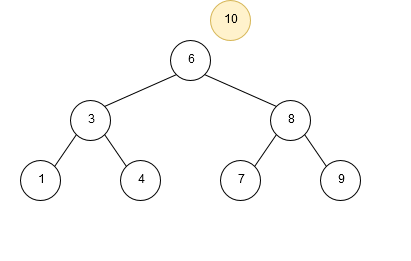

# Chapter 8 查找

## 基本概念

静态查找表：在查找过程中查找表本身不发生变化。对静态查找表进行的查找操作称为静态查找。

动态查找表：在查找过程中查找表可能会发生变化。对动态查找表进行的查找操作称为动态查找。

查找的基本方式可以分为比较式查找和计算式查找：

- 比较式查找法又可以分为**基于线性表**的查找法和**基于树**的查找法
- 而计算式查找法也称为**HASH（哈希）查找法**

**平均查找长度：$ASL = \sum_{i=1}^nP_iC_i$**

- $P_i$ 为查找列表中第 $i$ 个数据元素的概率
- $C_i$ 为找到该关键字时已经进行过的比较次数

## 静态表查找

### 顺序查找

### 有序表查找

## 动态表查找

### 二叉排序树

定义：二叉排序树也称为二叉查找树，二叉排序树或者是一棵空树；或者是具有如下特性的二叉树，

- 若它的左子树非空，则左子树上所有结点的值均小于根结点的值
- 若它的右子树非空，则右子树上所有结点的值均大于根结点的值
- 它的左右子树也分别为二叉排序树

性质：

- 如果对一棵二叉排序树进行**中序遍历**，可以按从小到大的顺序，将各结点关键字排列起来
- 由值相同的 n 个关键字，可以构造不同形态的二叉排序树

#### 插入



#### 删除

假设将要被删除的节点为 p，其父节点为 fp，判断 p 是否是以下几种情况：

- 如果 p 是叶节点，则直接删除
- 如果 p 只有左子树或右子树，
  - 如果 p 是 fp 的左子树，则删除 p 后将 p 的子树当做 fp 的左子树
  - 如果 p 是 fp 的右子树，则删除 p 后将 p 的子树当成 fp 的右子树
- 如果 p 既有左子树也有右子树，找到在中序序列中 p 的前驱节点 s，其父节点为 fs，将 s 的值复制到 p
  - 如果 s 是 fs 的左子树，则将 s 的左子树当成 fs 的左子树
  - 如果 s 是 fs 的右子树，则将 s 的左子树当成 fs 的右子树

注意：

- **s 一定不可能有右子树**

### 二叉平衡树

定义：**二叉平衡树又称为 AVL 树**，AVL 树或者是空树，或者是具有下列性质的二叉排序树，

- 左子树与右子树的高度之差的绝对值小于等于 1
- 左子树和右子树也是 AVL 树

节点的平衡因子：节点的左子树深度与右子树深度之差。

- 对一棵二叉平衡树而言，其所有结点的平衡因子只能是 -1, 0, 1
- 如果一棵二叉查找树是平衡的, 且有 n 个结点，平均查找长度为 $O(\log_2n)$

#### 平衡化旋转

分为以下四种情况：

- LL：失衡节点为 A，解决方式为对 A 进行右旋

````
    A
   /
  B
 /
C
````

- RR：失衡节点为 A，解决方式为对 A 进行左旋

````
A
 \
  B
   \
    C
````

- LR：失衡节点为 A，解决方式为先对 B 进行左旋，再对 A 进行右旋

````
    A
   /
  B
   \
    C
````

- RL：失衡节点为 A，解决方式为先对 B 进行右旋，再对 A 进行左旋

````
A
 \
  B
 /
C
````

## B 树和 B+ 树

## 散列表（哈希表）

定义：哈希法又称散列法、杂凑法或关键字地址计算法等，相应的表又称为哈希表。

> 创建哈希表时，把关键字为 $k$ 的元素直接存入地址为 $H(k)$ 的单元；以后当查找关键字为 $k$ 的元素时，再利用哈希函数计算出该元素的存储位置 $p = H(k)$。 

填装因子：$\alpha = \frac{n}{m}$，$m$ 为哈希表的长度，$n$ 为哈希表中元素的个数。

冲突：关键字值不同的元素映射到哈希表的同一地址上，即 $k1\ne 2$，但 $H(K_1)= H(k_2)$，这种现象称为冲突，此时称 $k1$ 和 $k2$ 为同义词。

解决冲突的方法：

- 开放定址法
- 链地址法