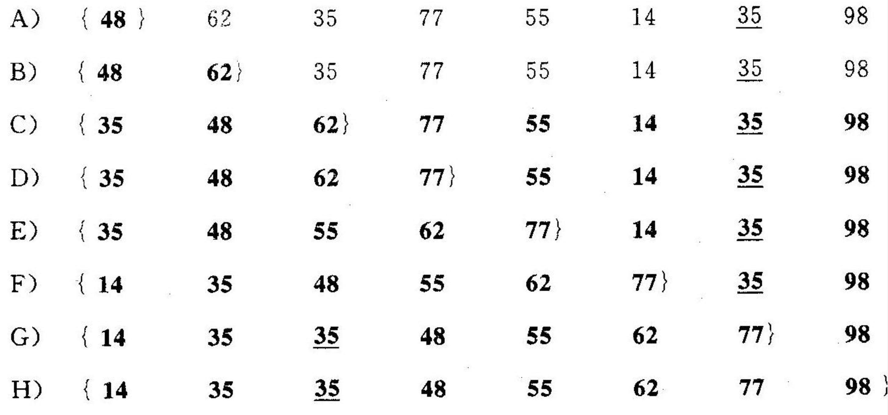
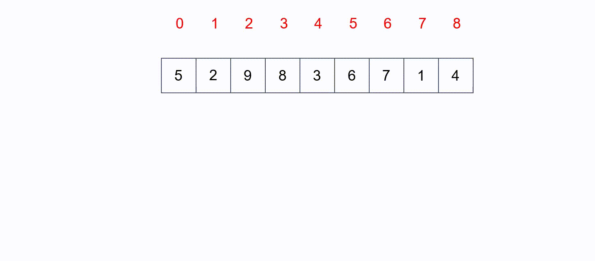
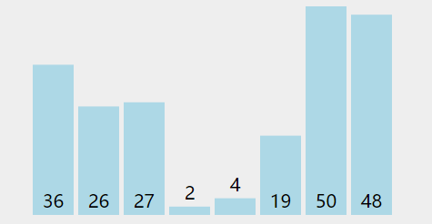
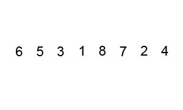
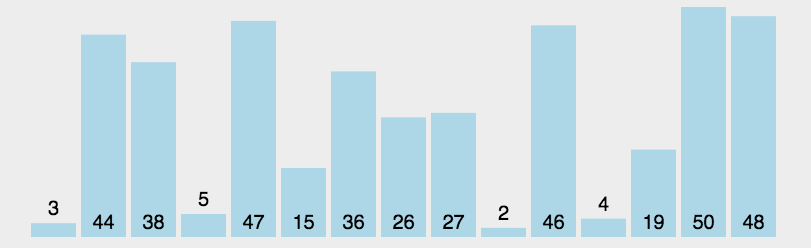
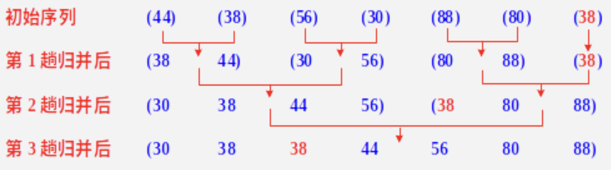
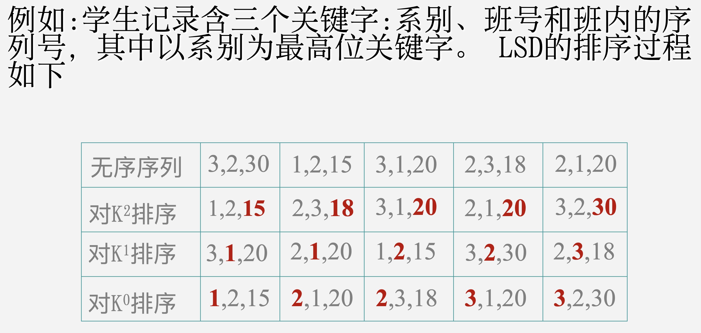
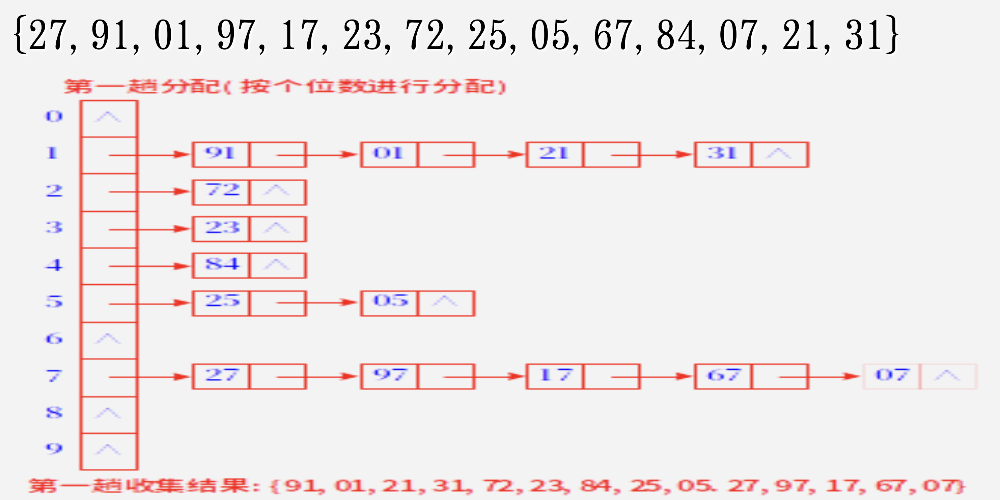
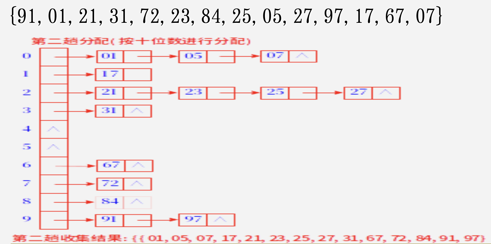

# Chapter 9 排序

关键字：是数据元素中的某个数据项。如果某个数据项可以唯一地确定一个数据元素，就将其称为主关键字；否则称为次关键字。

排序算法的稳定性：如果在待排序的记录序列中有多个数据元素的关键字值相同，经过排序后这些数据元素的相对次序仍然不变，则称这种排序算法是稳定的。

## 插入排序

### 直接插入排序



时间复杂度：$O(n^2)$。

### 希尔排序



## 交换排序

### 冒泡排序

每一趟会将当前参与排序的最大元素移动到序列的最后。



时间复杂度：在最好和最坏情况下的时间复杂度都是 $O(n^2)$。

### 快速排序

步骤：

1. 初始化指针与枢轴，选数组第一个元素作为枢轴 pivot，左指针 i 从左端开始，右指针 j 从右端开始
2. 移动右指针 j，向左找第一个小于 pivot 的元素；移动左指针 i，向右找第一个大于 pivot 的元素 (一定先移动右指针再移动左指针)
   - 如果 $i < j$，交换两个元素的位置，然后继续重复步骤 2
   - 如果 $i \ge j$，此时 j 指向的位置就是枢轴的最终位置，交换枢轴和 j 的位置
3. 此时左区域 $[left, j-1]$ 和右区域 $[j+1, right]$ 分别再次进行快速排序

```c++
void quickSort(std::vector<int>& elements, int left, int right) {
    if (left >= right)
        return;

    int pivot = elements[left];
    int i = left, j = right;

    while (i < j) {
        while (i < j && elements[j] >= pivot)
            j--;

        while (i < j && elements[i] <= pivot)
            i++;

        if (i < j)
            swap(elements[i], elements[j]);
    }

    swap(elements[left], elements[j]);

    quickSort(elements, left, j - 1);
    quickSort(elements, j + 1, right);
}
```



时间复杂度：$O(n\log_2n)$。

特点：

- 快速排序的递归次数和初始数列本身的顺序有关

## 选择排序

### 简单选择排序

步骤：

- 第 $i$ 趟简单选择排序是指通过 $n-i$ 次关键字的比较，从 $n-i+1$ 个记录中选出关键字最小的记录，并与第 $i$ 个记录进行交换



### 堆排序

大顶堆：大顶堆满足如下要求，

- 大顶堆是完全二叉树结构
- 父节点大于子节点

小顶堆：小顶堆满足如下要求，

- 小顶堆是完全二叉树结构
- 父节点小于子节点


具体讲解看 YouTube：

<iframe width="560" height="315" src="https://www.youtube.com/embed/2DmK_H7IdTo?si=psd7tbCgjCbiD_lB" title="YouTube video player" frameborder="0" allow="accelerometer; autoplay; clipboard-write; encrypted-media; gyroscope; picture-in-picture; web-share" referrerpolicy="strict-origin-when-cross-origin" allowfullscreen></iframe>

时间复杂度：$O(n\log_2n)$。

## 归并排序



时间复杂度：$O(n\log_2n)$

## 基数排序

### 多关键字排序

分为：

- 最高位优先法 MSD
- 最低位优先法 LSD



### 链式基数排序





## 各个排序的比较分析

| 排序方法名称 | 最好情况时间复杂度 | 最坏情况时间复杂度 | 平均时间复杂度              | 稳定性 |
| :----------- | :----------------- | ------------------ | --------------------------- | ------ |
| 直接插入排序 | $O(n)$             | $O(n^2)$           | $O(n^2)$                    | 稳定   |
| 希尔排序     | $O(n)$             | $O(n^2)$           | $O(n^{1.3})$ ~ $O(n^{1.5})$ | 不稳定 |
| 冒泡排序     | $O(n)$             | $O(n^2)$           | $O(n^2)$                    | 稳定   |
| 快速排序     | $O(n\log_2 n)$     | $O(n^2)$           | $O(n\log_2 n)$              | 不稳定 |
| 简单选择排序 | $O(n^2)$           | $O(n^2)$           | $O(n^2)$                    | 不稳定 |
| 堆排序       | $O(n\log_2n)$      | $O(n\log_2n)$      | $O(n\log_2n)$               | 不稳定 |
| 归并排序     | $O(n\log_2n)$      | $O(n\log_2n)$      | $O(n\log_2n)$               | 稳定   |
| 基数排序     | -                  | -                  | -                           | 稳定   |

- 希尔排序、快速排序和所有的选择排序（简单选择排序、堆排序）是不稳定的，其它排序方式都是稳定的
